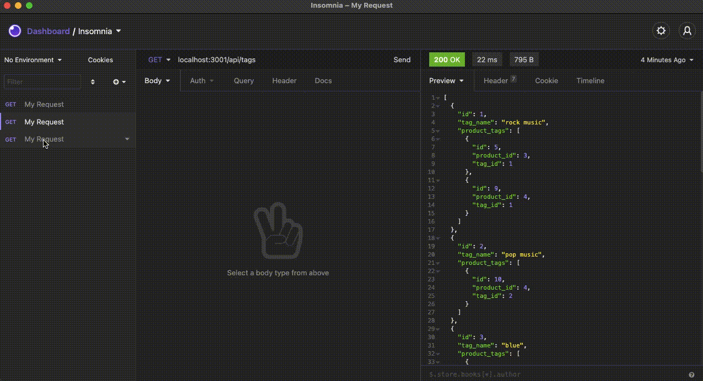

# ORM-E-Commerce-Back-End

 ## Description
Internet retail, also known as e-commerce, is the largest sector of the electronics industry, generating an estimated $29 trillion in 2019. E-commerce platforms like Shopify and WooCommerce provide a suite of services to businesses of all sizes. Due to their prevalence, understanding the fundamental architecture of these platforms will benefit you as a full-stack web developer.

Your task is to build the back end for an e-commerce site by modifying starter code. You’ll configure a working Express.js API to use Sequelize to interact with a MySQL database.
  
  ## Table of Contents
  - [Installation](#installation)
  - [Usage](#usage)
  - [Credits](#credits)
  - [License](#license)
  
  ## Installation
  npm i

  ## Usage
  User must clone the repository into their local computers, then open their terminals and run de app with node.

  ## License
  GPL 3.0

  ## How to Contribute
  Everyone can contribute to the project

  ## Tests
  npm test
  
  ## Questions
  If you have any questions about the repo, open an issue or contact me directly at eduardo31794@gmail.com You can find more of my work at https://github.com/Eduadomtz